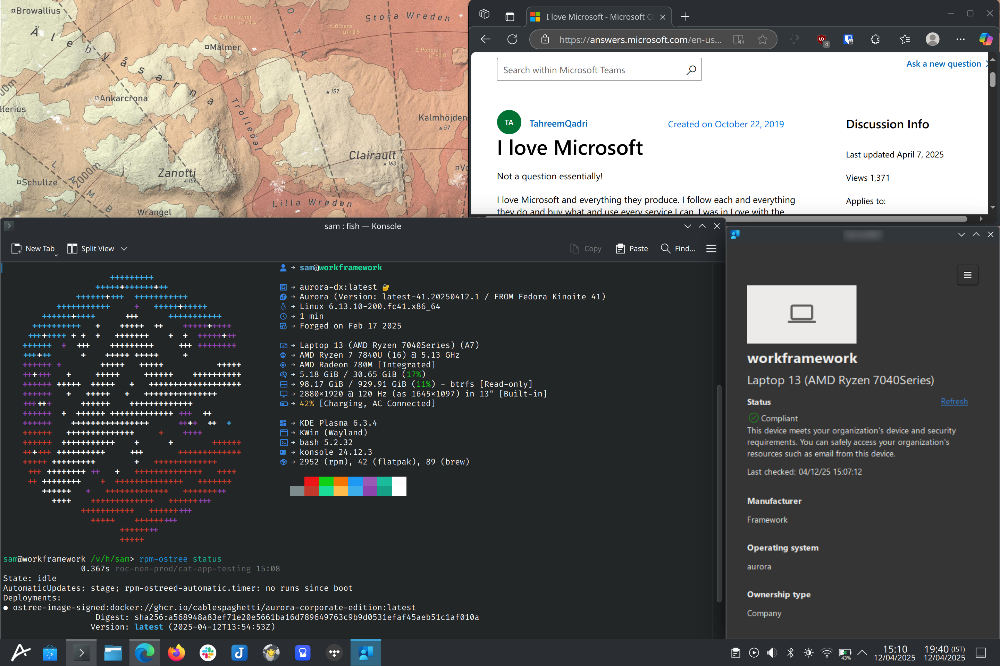

# Aurora DX Corporate Edition

This is a build of [Aurora](https://getaurora.dev), with Microsoft Intune and Edge pre-installed. As it is based on the Aurora "Developer Version" image you get lots of fun shiny developer tools like VSCode, Docker, Podman Desktop and a [bunch of other nice extras](https://docs.projectbluefin.io/bluefin-dx/) that will hopefully make your life as a corporate drone slightly more bearable.

I also plan on installing a patched version of OpenVPN which will works with AWS Client VPN in the near future.



## Why would you do such a thing?

My workplace, like many, requires that my machine is Intune compliant, and certain internal services will not load unless my machine is compliant and I use an unsandboxed version of Edge.

## How do I install this abomination?

As this is basically just Aurora with some bonus bits, I've not bothered building ISOs. Go and install Aurora using the ISOs on [their website](https://getaurora.dev), making sure that you **select the option for full disk encryption in the installer** if you want to be Intune compliant.

After your machine is set up, open a terminal and run:
```
rpm-ostree rebase ostree-image-signed:docker://ghcr.io/cablespaghetti/aurora-corporate-edition:latest
```

## Will I still get updates and is this secure?

The GitHub action that builds this image is configured to run every week on a Monday, and is based on the normal Aurora DX image, which in turn is based on Fedora Kinoite 42 (the immutable Plasma version of Fedora).

By default you will get all the same security patches as any other Fedora user, installed in the background without having to lift a finger.

If for some reason there is a problem with an update, you have the option to boot the previous image at boot time.

## Where can I get docs/support?

For general Aurora questions, the [Aurora](https://getaurora.dev) and [Bluefin docs](https://docs.projectbluefin.io/) are your best bet, as well as the [Universal Blue Discourse Forum](https://universal-blue.discourse.group) and their [Discord](https://discord.gg/WEu6BdFEtp). **However for anything specific to this image, please open a [GitHub issue here](https://github.com/cablespaghetti/aurora-corporate-edition/issues).**

## Do you support Nvidia drivers?

No sorry, this is based on the standard Aurora image so has no Nvidia/MS Surface drivers or anything like that.

## Why isn't this based on RHEL that seems way more corporate to me!?

I did initially want to build this based on top of CentOS Stream 10, which is almost RHEL. However [Intune only support RHEL 8 and 9](https://learn.microsoft.com/en-us/intune/intune-service/fundamentals/supported-devices-browsers) at this time and it has some super old dependencies which aren't available in CentOS Stream 10, so until RHEL 10 support comes out we'll stick with a Fedora base.

